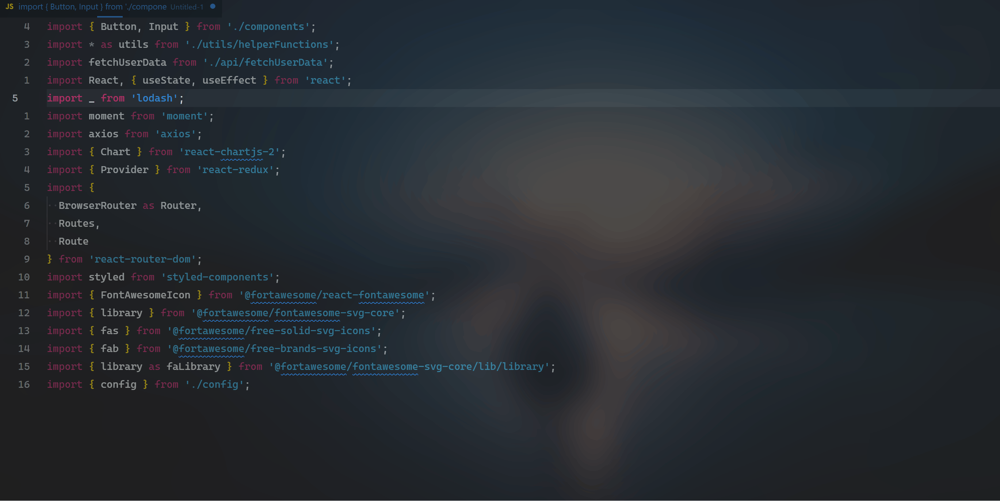

# ES6 Import Sort

**ES6 Import Sort** 是一个对选中的导入语句文本进行排序的插件。

## 支持的命令

通过 VSCode 命令面板（按 `Ctrl+Shift+P`）执行

-   `import-sort.import-sort-desc`
    > 对选中的导入文本进行降序
-   `import-sort.import-sort-asc`
    > 对选中的导入文本进行升序
-   `import-sort.common-sort-desc`
    > 对选中的变量进行降序
-   `import-sort.common-sort-asc`
    > 对选中的变量进行升序

**对变量进行排序不支持已经被格式化之后的换行的变量，例：**

```js
const { BC, SIIH, SIW, aisdash } = getName()
```

**不支持上面的格式**

# ES6 Import Sort

**ES6 Import Sort** is a plugin that sorts the selected import statements.

## Supported Commands

Execute via the VSCode command palette (press `Ctrl+Shift+P`):

-   `import-sort.import-sort-desc`
    > Sort the selected import statements in descending order.
-   `import-sort.import-sort-asc`
    > Sort the selected import statements in ascending order.
-   `import-sort.common-sort-desc`
    > Sort the selected variables in descending order.
-   `import-sort.common-sort-asc`
    > Sort the selected variables in ascending order.

**Sorting variables does not support variables that have been formatted with line breaks, for example:**

```js
const { BC, SIIH, SIW, aisdash } = getName()
```

## 演示



